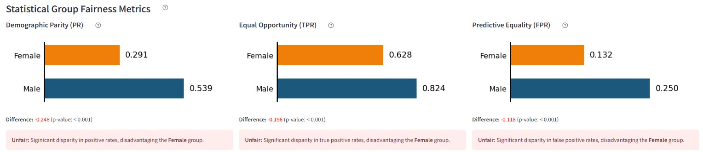
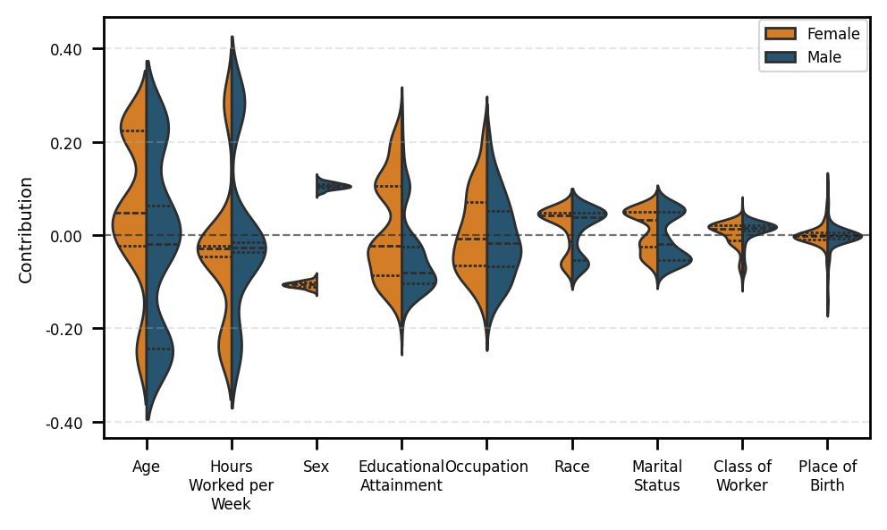
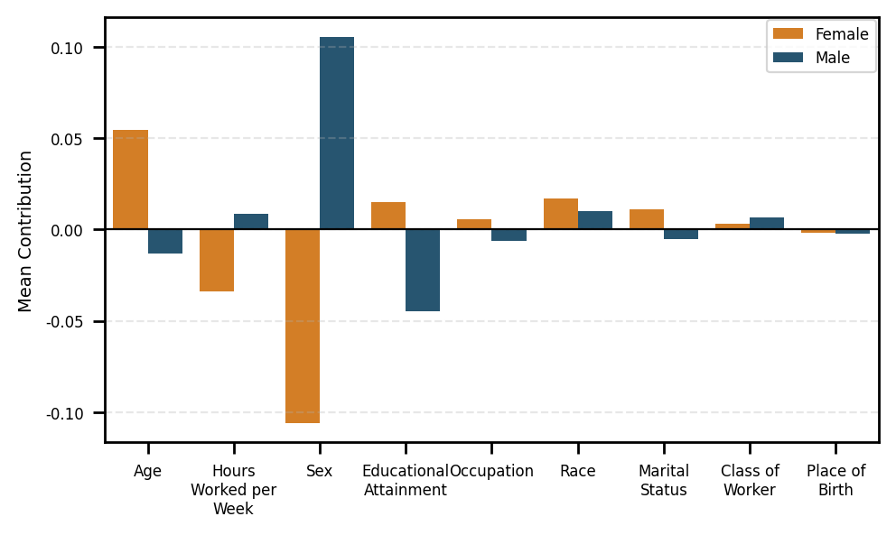
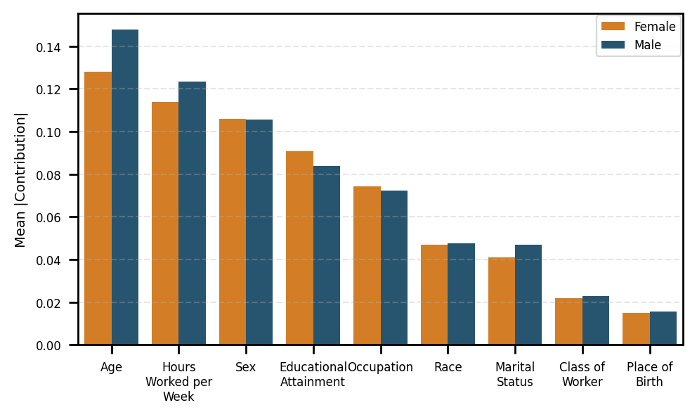
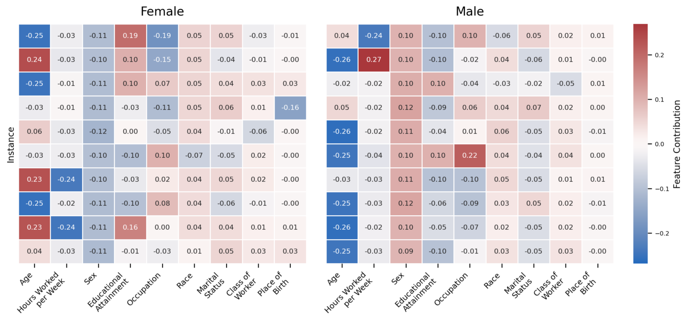
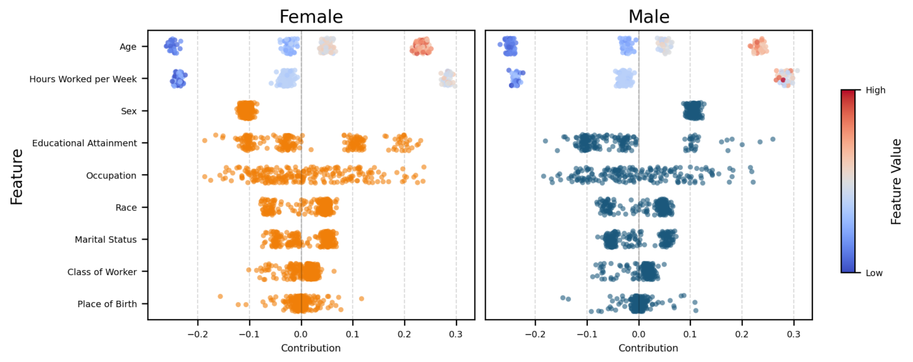

<p align="center">
  <a href="https://openproceedings.org/2026/conf/edbt/paper-334.pdf">
    
  </a>
  <a href="https://drive.google.com/drive/u/1/folders/1td81GGrWWoMvRuQkhSs_ayDxWE7VNjmu">
    
  </a>
  <a href="https://github.com/VasilikiPapanikou/MIMOSA/blob/main/LICENSE">
    
  </a>
  
</p>

<p align="center">
  
</p>

<p align="center">
  <em>A Tool for Fairness Exploration Through Explanations</em>
</p>

<p align="center">
  <a href="https://orcid.org/0009-0004-0785-4727">Vasiliki Papanikou</a> &nbsp;·&nbsp;
  <a href="https://orcid.org/0000-0002-3154-6212">Danae Pla Karidi</a> &nbsp;·&nbsp;
  <a href="https://orcid.org/0000-0002-3775-4995">Evaggelia Pitoura</a> &nbsp;·&nbsp;
  <a href="https://orcid.org/0000-0001-9134-9387">Emmanouil Panagiotou</a> &nbsp;·&nbsp;
  <a href="https://orcid.org/0000-0001-5729-1003">Eirini Ntoutsi</a>
</p>

---

As Artificial Intelligence (AI) is increasingly used in areas that impact human lives, concerns about fairness and transparency have grown, especially for protected groups. To better understand such concerns, explainability techniques can be leveraged not only for model interpretation but also to assess potential biases. 
The **MIMOSA**<sup>*</sup> tool utilizes both individual and group explanation methods as bias detectors. It allows users to compare group fairness metrics with explanation findings, identify which features contribute to biased outcomes, visualize explanations through multiple perspectives and apply fairness interventions while tracking how feature contributions change. The tool is designed to be accessible to a wide audience of users, including sociologists, domain experts and machine learning practitioners.

---
##  Features

-  **Dataset and focus-group selection** — choose a dataset and define protected groups for fairness exploration.
-  **Fairness metrics** — compare group fairness metrics and inspect disparities between protected groups.
-  **Explanation methods** — analyze model behavior using individual and group explanation methods.
-  **Visual explanations** — explore feature contributions through plots such as heatmaps, violin plots and summary visualizations.
-  **Fairness interventions** — apply mitigation strategies and compare explanations before and after intervention.

## Example Visualizations

<p align="center">
  
</p>

<p align="center">
  <em>Comparison of fairness metrics across protected groups.</em>
</p>

<table>
  <tr>
    <td align="center">
      
      <br>
      <em>(a) Violin plot</em>
    </td>
    <td align="center">
      
      <br>
      <em>(b) Mean contribution plot</em>
    </td>
    <td align="center">
      
      <br>
      <em>(c) Mean absolute contribution plot</em>
    </td>
  </tr>
  <tr>
    <td align="center" colspan="2">
      
      <br>
      <em>(d) Heatmap</em>
    </td>
    <td align="center">
      
      <br>
      <em>(e) Beeswarm plot</em>
    </td>
  </tr>
</table>

<p align="center">
  <em>
    Example explanation visualizations produced by MIMOSA: violin, mean contribution,
    mean absolute contribution, heatmap and beeswarm plots.
  </em>
</p>

## Installation & Usage

### Prerequisites
- Python 3.8+

### Install dependencies
```bash
pip install -r requirements.txt
```

### Run the app
```bash
streamlit run app.py
```

---

## Citing

If you use MIMOSA in your research, please cite:

```bibtex
@inproceedings{papanikou2026mimosa,
  title     = {MIMOSA: A Tool for Fairness Exploration Through Explanations},
  author    = {Papanikou, Vasiliki and Pla Karidi, Danae and Pitoura, Evaggelia and Panagiotou, Emmanouil and Ntoutsi, Eirini},
  booktitle = {Proceedings of the 29th International Conference on Extending Database Technology (EDBT)},
  year      = {2026}
}
```

<sup>*</sup> *The mimosa flower symbolizes purity, innocence and sensitivity, values that are essential in the pursuit of truth, justice and fairness.*
